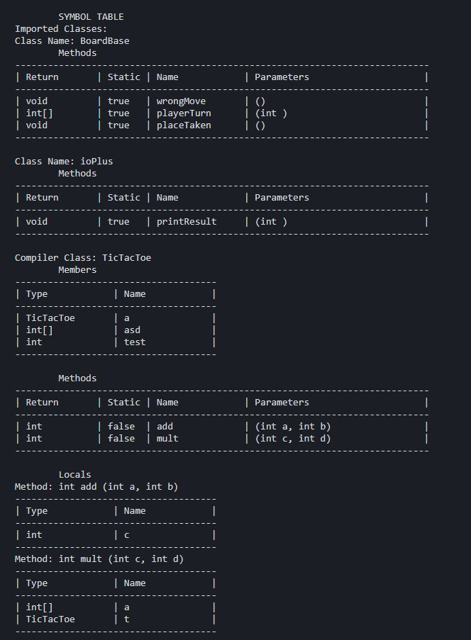

# Symbol Table
After the parser builds the AST the compiler builds the symbol table. The symbol consists of a hashmap of imported classes and the class to be compiled. Each class contains a hashmap of member variables and methods. Within each method there is a list of parameters and hashmap of local variables. Since Java-- doesn't allow locals to be declared outside the initial scope this data structure is enough.

A representation of the symbol table can be printed using the argument ``-printTable`` as seen in user instructions. 

Example of a printed symbol table:

